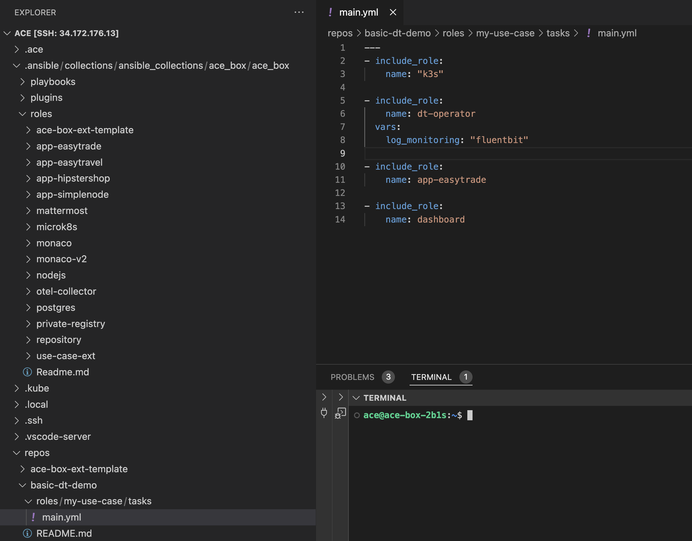

# Run use case locally

Now that we know that our provisioning script is located under [roles/my-use-case/tasks/main.yml](https://github.com/dynatrace-ace/basic-dt-demo/blob/main/roles/my-use-case/tasks/main.yml), we will learn how can we make changes and see them reflected while working in our use case.

Let's start reviewing an important feature of Ansible

## Ansible idempotency

One of the key benefits of re-running an Ansible script is idempotency. This means that you can safely run the script multiple times, and it will ensure that the system reaches the desired state without causing unintended changes or errors. Here are some specific advantages:

- Consistency: Re-running the script ensures that the system configuration remains consistent and correct, even if changes have been made manually or by other processes.
- Error Recovery: If a previous run of the script failed or was interrupted, re-running it can complete the configuration without starting from scratch.
- Ease of Updates: When updates or changes are needed, you can modify the script and re-run it to apply the updates across all target systems.
- Automation: Regularly re-running scripts can automate maintenance tasks, ensuring systems are always in the desired state without manual intervention.
These benefits make Ansible a powerful tool for managing and maintaining infrastructure efficiently.

## ace enable --local

1. Within your ACE-Box instance (check how to access [here](../01_get-started/3_add_use_case.md#access-your-ace-box-instance)), run the following command:

```
ace enable https://github.com/dynatrace-ace/basic-dt-demo.git --local
```

The `--local` setting is forcing the ACE-Box to re-run everything using the local resources:
- ACE-Box local resources: `/home/ace/.ansible/collections/ansible_collections/ace_box/ace_box/roles`
- Use case local resources: `/home/ace/repos/basic-dt-demo/roles/my-use-case/tasks`





That means that you can add, remove or edit roles in the fly, and see the changes reflected in the provisioning.

In the following guideline, we will do some mofifications to our use case using the previous command to apply the changes.
