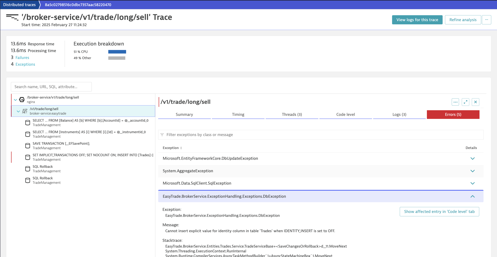
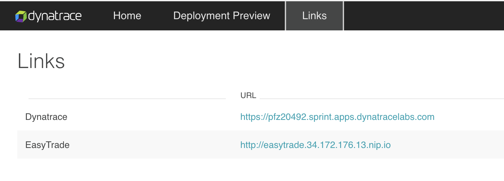
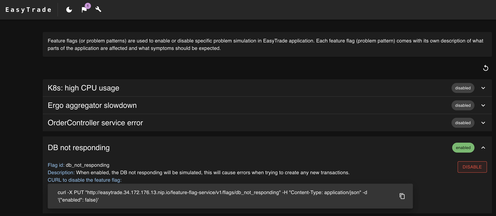
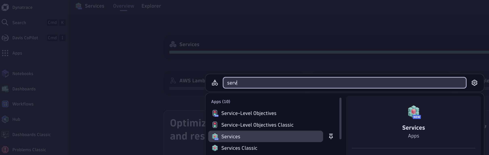
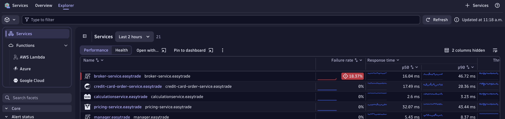
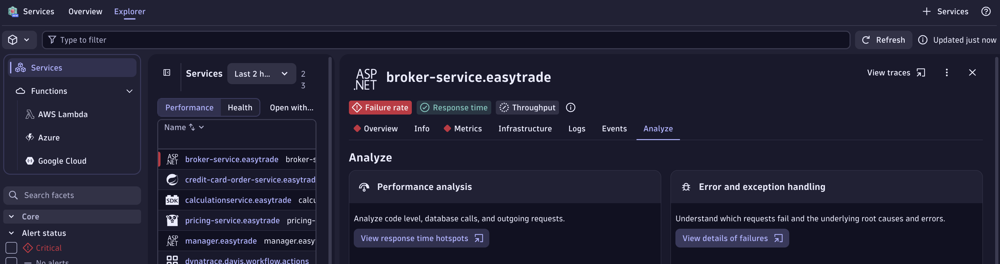
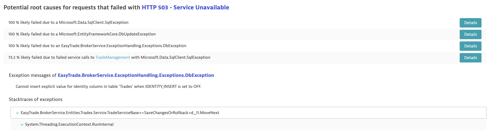
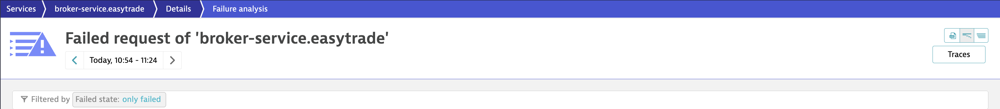

# First steps into Dynatrace Observability

## Value

Real world scenario of Dynatrace monitoring an application running in a Kubernetes cluster, providing visibility into:
- APM & Logs
- Application Security
- Infrastructure & Resource consumption

Using a realistic environment you will run through similar scenarios to the ones provided in the documentation, in order to learn:
- [Drill-down to service failure causes](https://docs.dynatrace.com/docs/analyze-explore-automate/distributed-traces/use-cases/error-analysis)
- [Use logs in context to troubleshoot issues](https://docs.dynatrace.com/docs/analyze-explore-automate/logs/lma-use-cases/lma-e2e-troubleshooting) _coming soon..._
- [Assess and troubleshoot cluster health](https://docs.dynatrace.com/docs/observe/infrastructure-monitoring/container-platform-monitoring/use-cases/cluster-health) _coming soon..._
- [Optimize workload resource usage with Kubernetes app and Notebooks](https://docs.dynatrace.com/docs/observe/infrastructure-monitoring/container-platform-monitoring/use-cases/resource-optimization) _coming soon..._
- [Troubleshoot common health problems of Kubernetes workloads](https://docs.dynatrace.com/docs/observe/infrastructure-monitoring/container-platform-monitoring/use-cases/troubleshoot-health-problems) _coming soon..._
- [Visualize and analyze security findings](https://docs.dynatrace.com/docs/secure/use-cases/visualize-and-analyze-security-findings) _coming soon..._



> Note: there are not exactly the same use cases as in the documentation, but you can see the instructions below

## Setup

import Tabs from '@theme/Tabs';
import TabItem from '@theme/TabItem';

You can enable an use case within your ACE-Box in two different ways

<Tabs>
  <TabItem value="ACE-CLI" label="ACE-CLI" default>
  - Use ACE-CLI if you already have deployed an empty ACE-Box
  - Follow the [Enable Use Case](../01_get-started/3_add_use_case.md) instructions
  </TabItem>
  <TabItem value="terraform.tfvars (Recommended)" label="terraform.tfvars (Recommended)" default>
  - You can add the following line to your `terraform.tfvars` in order to automatically install the use case after executing the `terraform apply` command

    ```bash
    use_case = "https://github.com/dynatrace-ace/basic-dt-demo.git"
    ```

  - This becomes very handy from a provisioning perspective. You don't need to first create the ACE-Box and then enable the use case, but everything happens with a sigle click!
  </TabItem>
</Tabs>

### Version & Compatibility

ACE-Box version 1.28.8

## Instructions

### Drill-down to service failure causes

Goal: we will intentionally break our EasyTrade app, and analyze the failure causes in Dynatrace

1. Within your ACE-Box, run the following command

```bash
kubectl get ingress -A
```

> Note: remember that you can access your ACE-Box instance like [this](../01_get-started/3_add_use_case.md#access-your-ace-box-instance)

2. Copy the dashboard URL and paste it in your browser, then click on Links:

```bash
dashboard.<IP_PLACEHOLDER>.nip.io
```



3. Open EasyTrade in your browser, click on the flag button at the top-left corner next, and enable the `DB not responding` feature-flag



4. Open your Dynatrace tenant, and go to the (New) Services app



5. Check for services with a high failure rate, in our case, `broker-service.easytrade`. Depending for how long you had the use case up and running, Dynatrace may open a problem or not. It depends for Davis to have enough datapoints to have a reliable source of data to actually open it.



6. Click on the `broker-service.easytrade`, go to the `Analyze` tab and click on `View details of failures`



7. Check the Easytrade service class and method throwing the exception, exception message and stacktrace



8. Scroll up to the top, and click on the traces button



9. Open a trace and analyze particularly that case


Well done, you manage to detect and understand the root cause of the failure. With the details of the exception, classes & methods, now you can fix the code.

### Use logs in context to troubleshoot issues

Coming soon...

### Assess and troubleshoot cluster health

Coming soon...

### Optimize workload resource usage with Kubernetes app and Notebooks

Coming soon...

### Troubleshoot common health problems of Kubernetes workloads

Coming soon...

### Visualize and analyze security findings

Coming soon...

## Well Done!

Go back to your ACE-Box [management page](../01_get-started/4_manage.md)